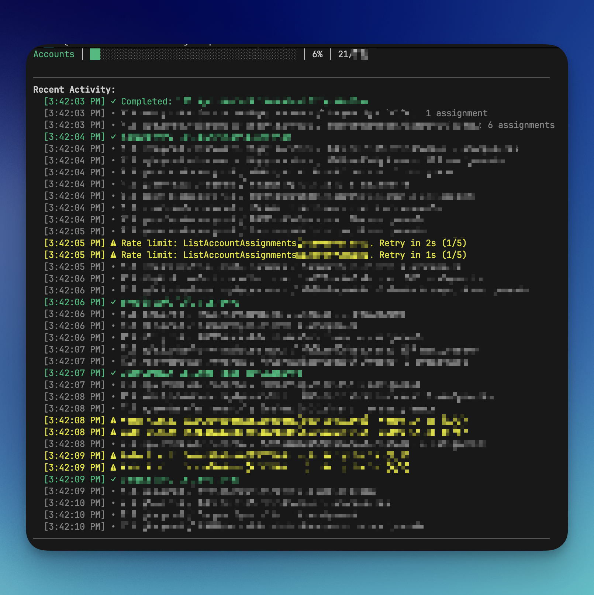

# AWS SSO Access Assignment List Builder



A TypeScript tool that generates a comprehensive access assignment report for your entire AWS Organization. It queries IAM Identity Center (AWS SSO) and produces a detailed CSV listing every user's permission set assignments across all accounts.

## What This Does

This tool builds a complete access inventory for your AWS Organization. It:

- Enumerates all AWS accounts in your organization
- Discovers all SSO permission sets configured in IAM Identity Center
- Maps every user-to-permission-set assignment across all accounts
- Expands group memberships to show individual user access
- Generates a CSV file with the complete access assignment matrix

## Output Format

The tool generates a CSV file with a complete access assignment list containing these columns:

```
Account Number, Account Name, Username, Permission Set, Group
```

Example output:

```
123456789012, Production Account, john.doe, AdministratorAccess,
123456789012, Production Account, jane.smith, ReadOnlyAccess,
234567890123, Staging Account, john.doe, DeveloperAccess, Developers
234567890123, Staging Account, bob.jones, DeveloperAccess, Developers
```

**Column Descriptions:**
- **Account Number**: AWS account ID
- **Account Name**: Human-readable account name from AWS Organizations
- **Username**: Individual user's SSO username
- **Permission Set**: The permission set (role) assigned
- **Group**: Group name if access was granted via group membership (empty for direct user assignments)

**Notes:**
- Each row represents one user's access to one permission set in one account
- Group-based assignments are expanded to show individual users
- Deleted users/groups appear as `[Deleted User: <id>]` or `[Deleted Group: <id>]`


## Features

### Performance Optimizations

**Parallel Processing**: Uses controlled concurrency to process multiple accounts and permission sets simultaneously. Instead of querying accounts one-by-one, the script runs up to 10 requests in parallel (configurable).

**Smart Caching**: When the same user appears in multiple accounts (which is common), we only fetch their details once and cache the result. This typically reduces API calls by 60-80%.

**Rate Limit Protection**: Two-layer defense against AWS throttling:
1. Proactive concurrency limiting prevents overwhelming the API
2. Automatic exponential backoff with retry if rate limits are hit

### Rate Limiting & Backoff

If AWS starts throttling requests, the script automatically backs off:

```
Attempt 1: Wait 1 second   (1s + jitter)
Attempt 2: Wait 2 seconds  (2s + jitter)
Attempt 3: Wait 4 seconds  (4s + jitter)
Attempt 4: Wait 8 seconds  (8s + jitter)
Attempt 5: Wait 16 seconds (16s + jitter)
```

Each retry waits exponentially longer, giving AWS time to recover. Random jitter prevents multiple requests from retrying simultaneously.

### Progress Tracking

Real-time progress bars show:
- Overall progress (accounts × permission sets)
- Which account is currently being processed
- How many assignments found so far
- Percentage complete

## Prerequisites

### AWS Permissions

Your credentials need these read-only permissions:

```
organizations:ListAccounts
sso:ListInstances
sso:ListPermissionSets
sso:DescribePermissionSet
sso:ListAccountAssignments
identitystore:DescribeUser
identitystore:DescribeGroup
identitystore:ListGroupMemberships
```

### AWS Credentials

Configure your credentials via:
- Environment variables (`AWS_ACCESS_KEY_ID`, `AWS_SECRET_ACCESS_KEY`)
- AWS config file (`~/.aws/credentials`)
- IAM role (if running on EC2/ECS)

## Installation

```bash
npm install
```

## Usage

### Basic Usage

```bash
npm start
```

The script will display real-time progress and write results to `sso-assignments.csv` in the current directory.

### Configuration

Edit the constants at the top of `query-sso-admin-access.ts`:

```typescript
// AWS Region (where your SSO instance lives)
const AWS_REGION = "us-west-2"

// Concurrency: how many parallel API requests
const CONCURRENCY_LIMIT = 10

// Retry behavior
const MAX_RETRIES = 5
const INITIAL_RETRY_DELAY = 1000  // milliseconds

// Output file
const OUTPUT_FILE = "sso-assignments.csv"
```

### Tuning for Your Environment

**If the script is too slow:**
- Increase `CONCURRENCY_LIMIT` to 15 or 20

**If you see rate limit warnings:**
- Decrease `CONCURRENCY_LIMIT` to 5
- Increase `MAX_RETRIES` to 8
- Increase `INITIAL_RETRY_DELAY` to 2000

**For large organizations (100+ accounts):**
- Keep `CONCURRENCY_LIMIT` at 10 (safer)
- Increase `MAX_RETRIES` to 10

## How It Works

### The Caching System

AWS SSO users often have access to multiple accounts. Without caching, we'd query the same user 50 times if they appear in 50 accounts.

**With caching:**
```
Processing Account 1:
  - Need user "abc123"
  - Check cache: NOT FOUND
  - Call AWS API → get "john.doe"
  - Store: userCache["abc123"] = "john.doe"
  - Time: 150ms

Processing Account 2:
  - Need user "abc123"
  - Check cache: FOUND → "john.doe"
  - Return immediately (no API call)
  - Time: <1ms ⚡

Processing Account 3:
  - Need user "abc123"
  - Check cache: FOUND → "john.doe"
  - Return immediately (no API call)
  - Time: <1ms ⚡
```

Result: 150ms instead of 450ms (3x faster!)

### Performance Estimates

For a typical organization with:
- 50 accounts
- 10 permission sets per account
- 20 unique users appearing across accounts

**Without optimizations:**
- ~15-25 minutes (sequential processing)
- 1000+ API calls for user lookups

**With optimizations:**
- ~2-5 minutes (parallel + caching)
- Only 20 API calls for users (cached thereafter)
- **5-10x faster**

## Troubleshooting

### "Region is missing" Error

Set your AWS region:
```bash
export AWS_REGION=us-west-2
npm start
```

Or edit `AWS_REGION` at the top of the script.

### Rate Limit Errors

You'll see warnings like:
```
⚠️  Rate limit hit for DescribeUser. Retrying in 3s (attempt 2/5)...
```

This is normal - the script will automatically retry. If you see many of these:
- Decrease `CONCURRENCY_LIMIT` to 5
- The script will run slower but more reliably

### "ResourceNotFoundException" for Groups

Some groups may have been deleted but still have assignments. These are silently handled and marked as `[Deleted Group: <id>]` in the output.

## Use Cases

This access assignment list is useful for:

- **Security Audits**: Review who has access to what across your organization
- **Compliance Reporting**: Generate access reports for auditors
- **Access Reviews**: Identify over-privileged users or unnecessary permissions
- **Onboarding/Offboarding**: Verify access is properly granted or revoked
- **Organization Analysis**: Understand access patterns across accounts and teams

## Contributing

Feel free to modify the tool for your needs. Common customizations:

- Filter by specific permission sets or accounts
- Output to JSON or Excel format
- Add email addresses or other user attributes
- Include permission set policies for detailed analysis

## License

Use freely. No warranty provided.
